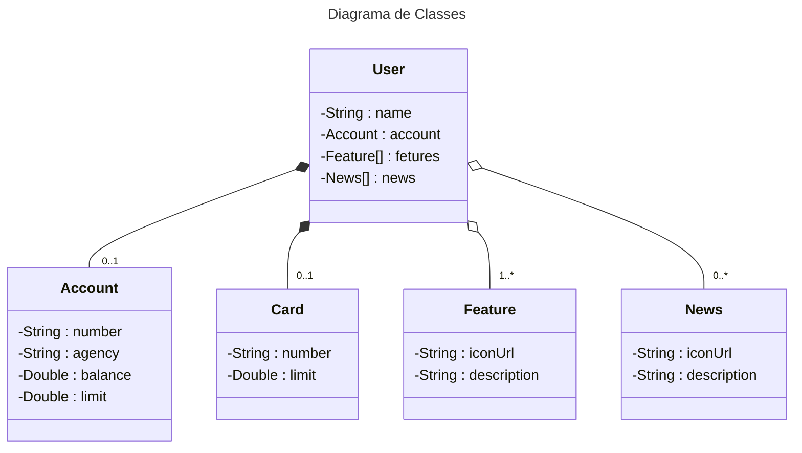

<h1>Spring Boot Framework</h1>
Um projeto de aplicação mobile com backend Rest-Api.

```mermaid

---
title: Diagrama de Classes
---

classDiagram 

    class User {
      -String : name
      -Account : account
      -Feature[] : fetures
      -News[] : news
    }
    
    class Account {
       -String : number
       -String : agency 
       -Double : balance
       -Double : limit
    }
    
    class Feature {
      -String : iconUrl
      -String : description
    }

    class Card {
      -String : number
      -Double : limit
    }

    class News {
      -String : iconUrl
      -String : description
    }

    User *-- "0..1" Account
    User *-- "0..1" Card
    User o-- "1..*" Feature
    User o-- "0..*" News
```
